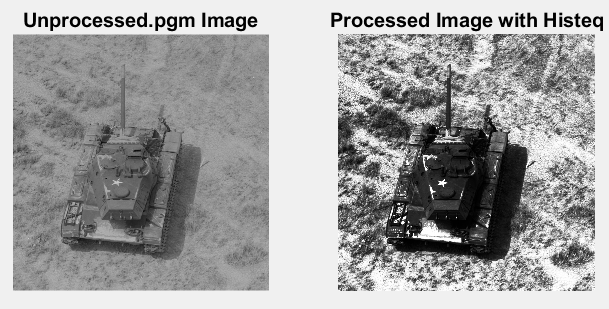
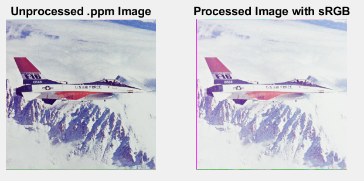

# Final Project Image Processing
The following project focuses on image processing, giving several enhancement options to apply on the image. The repo includes two test images, one in color .ppm form and the other in greyscale .pgm form. These are the only two file types that are supported by this program. Both can be found in the images folder. Output images created are also stored in the same folder. 

### Parameter Options
The program provies many options to the user such as changing the input file to be processed, and output file name. If the input file has different dimensions then the default, height and width can be changed to match. The program also supports multithreading to process the image faster by splitting the image into a specifed number of sections for individual threads to complete.\
It also uses ImageMagick to perform two additional options. The first is a display option, to display the output image. The other is a convert feature to convert the output image to a .png for a more common file type and an easier way to view the image.\
Finally the program supports 4 different image processing options:\
Greyscale\
sRGB\
Histogram Equalization\
Inversion

Note: Since .pgm file are already greyscale, the greyscale function has no effect

### Example outputs with orignial image

What was typed './image -i tank.pgm -e histeq -t 3'

What was typed './image -i airplane.ppm -e clrspc-sRGB -t 5'

